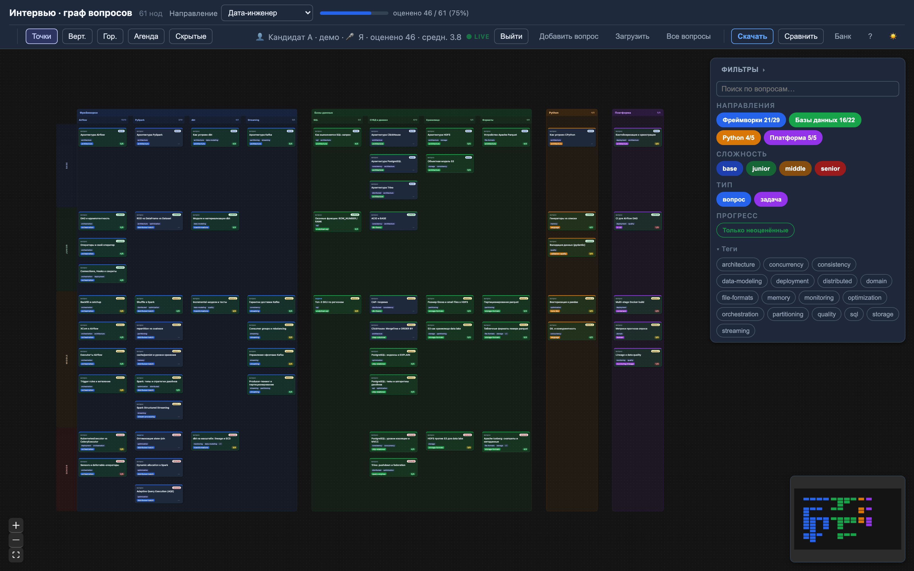
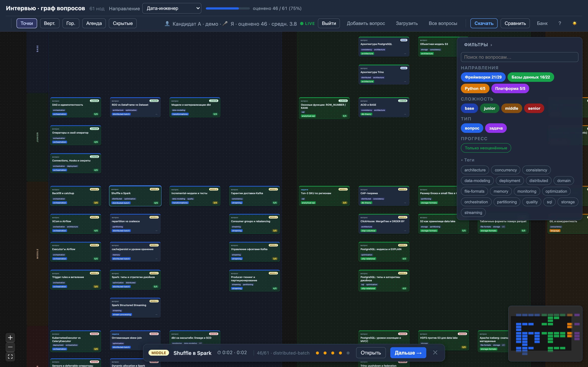
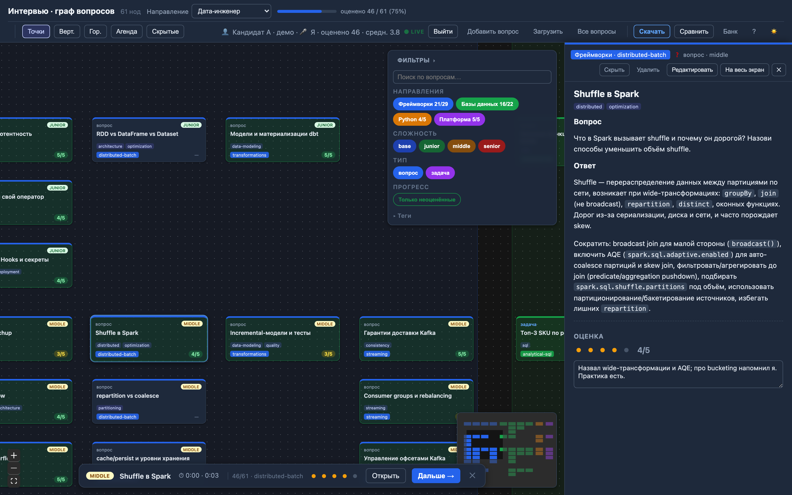
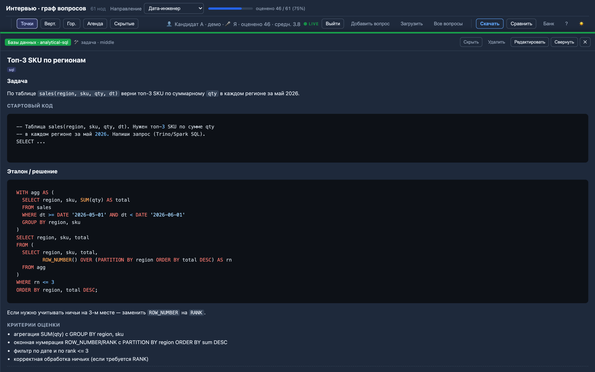
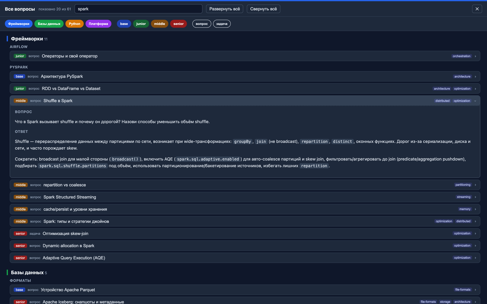
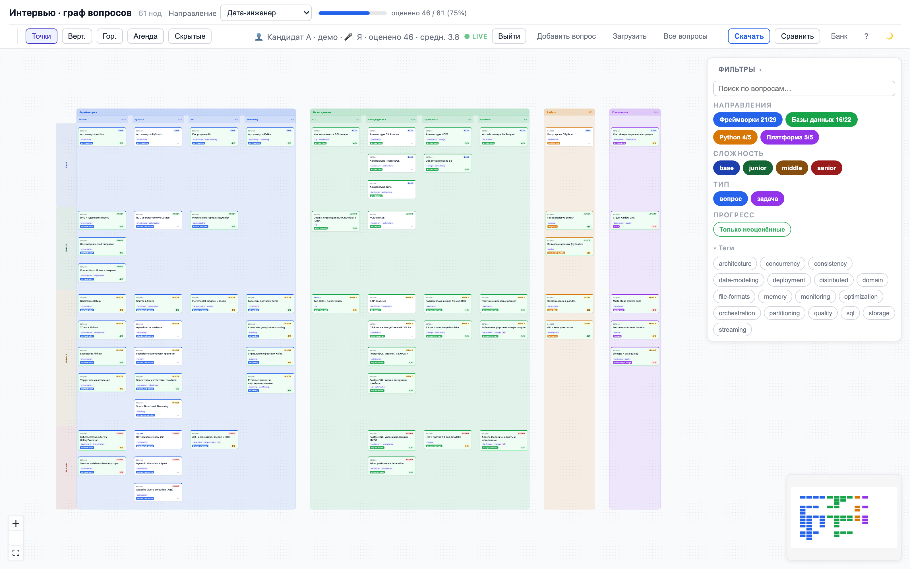
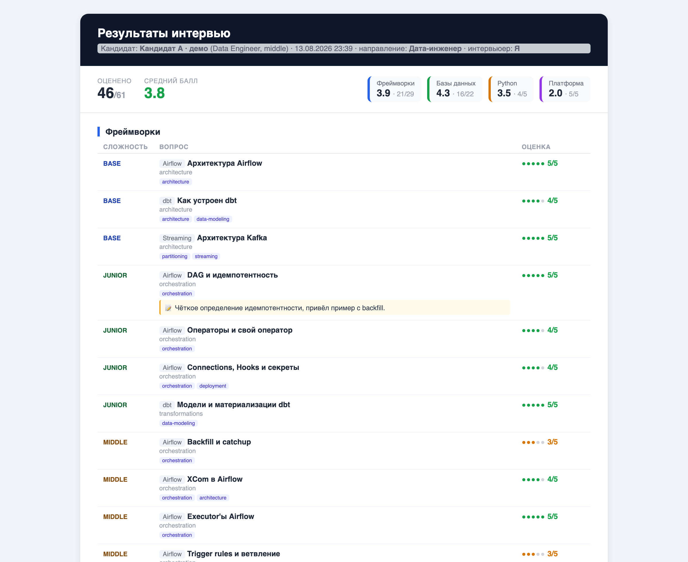

# Интервью · граф вопросов

Локальный веб-сервис для технических интервью по дата-инженерному стеку команды.
Ядро — интерактивная **доска вопросов** на канве: вертикальная колонка на каждое направление
(Фреймворки / Базы данных / Python / Платформа), внутри колонки карточки ранжированы по
сложности (base → junior → middle → senior). Карточка = вопрос или задача + эталонный ответ +
оценка 1–5 и заметка интервьюера. Контент живёт в Markdown/JSON и импортируется в банк вопросов.

Интервьюер ведёт всё интервью на одном экране: видит покрытие по направлениям в реальном
времени, ставит оценки с клавиатуры, а на выходе получает самодостаточный HTML-отчёт по
кандидату.

Стек: **FastAPI + SQLite** (бэкенд) · **React + Vite + React Flow** (фронт). Только локально,
за логином (локальные аккаунты, роли owner / member / viewer).

## Как это выглядит

Доска в разгаре интервью: 61 вопрос по четырём направлениям, прогресс `46/61`, оценённые
карточки помечены баллом, справа — фильтры по направлениям, сложности, типу и тегам.



| | |
| --- | --- |
| **Оценка с клавиатуры.** Клавиши `1–5` ставят балл текущему вопросу, `n` перебрасывает на следующий неоценённый; снизу — HUD текущего вопроса (таймер вопроса и сессии включается в ⚙).<br><br>[](docs/screenshots/02-scoring.png) | **Полный текст рядом с доской.** Немодальный drawer: вопрос, эталонный ответ с подсветкой кода, оценка и заметка интервьюера — доска остаётся интерактивной.<br><br>[](docs/screenshots/03-drawer.png) |
| **Практические задачи.** Кроме вопросов в банке есть задачи: условие, стартовый код, эталонное решение и критерии оценки.<br><br>[](docs/screenshots/04-task.png) | **Банк вопросов.** Полнотекстовый поиск и фильтры по всему банку; вопросы правятся и добавляются прямо из интерфейса.<br><br>[](docs/screenshots/05-bank.png) |
| **Светлая тема.** Переключается в шапке, выбор запоминается; по умолчанию берётся системная.<br><br>[](docs/screenshots/07-board-light.png) | |

**Итоговый отчёт** генерируется на клиенте одним самодостаточным HTML-файлом: шапка с кандидатом
и интервьюером, средний балл и охват по направлениям, таблицы оценённых вопросов с заметками.
Открывается в браузере и печатается в PDF.



> Скриншоты пересобираются командой `npm run shots` из `frontend/` — см. [Тесты](#тесты).

## Быстрый старт

```bash
INTERVIEW_OWNER_PASSWORD=<пароль> ./run.sh   # venv + сборка фронта (если нужно) + сервер
# открыть http://localhost:8000 и войти как owner@interview.local
```

Открывается главное меню: направления (доски), Кандидаты, Сессии, Подключение; банк вопросов —
по направлению.

Первый запуск заводит owner-аккаунт `owner@interview.local`. Если `INTERVIEW_OWNER_PASSWORD`
не задан, пароль генерируется случайно и печатается в лог сервера — известный дефолт не
используется намеренно. Пересобрать фронт принудительно: `./run.sh --build`.

## Docker

Самодостаточный образ: фронт собирается внутри, наружу торчит только том с БД —
ни node, ни python на хосте не нужны.

```bash
docker compose up -d --build     # http://localhost:8000
docker compose logs -f           # логи
docker compose down              # остановить (данные остаются в томе)
docker compose down -v           # снести вместе с данными
```

Логин — `admin` / `admin`. Известные креды заданы в `compose.yaml` намеренно: owner
сидится в БД один раз, а том постоянный, так что случайные означали бы «после первого
старта войти уже нельзя». Свои — `INTERVIEW_OWNER_EMAIL=<логин>
INTERVIEW_OWNER_PASSWORD=<пароль> docker compose up -d`; сменить на уже поднятом сервисе —
только с пересозданием тома (`docker compose down -v`).

Если `:8000` занят (например, там уже крутится `./run.sh`) —
`INTERVIEW_PORT=8080 docker compose up -d`.

Раскладка внутри контейнера повторяет серверную из `deploy/bootstrap.sh`: код в `/app`,
контент в `/app/content`, БД — в именованном томе на `/data`. Поэтому пересборка образа
не трогает данные, а `content/` можно держать read-only: бэкенд туда не пишет
(загруженные файлы парсятся во временном каталоге и едут в БД).

## Режим разработки (hot reload)

Два процесса:

```bash
# терминал 1 — бэкенд
cd backend && . .venv/bin/activate && uvicorn app.main:app --reload --port 8000

# терминал 2 — фронт (Vite проксирует /api на :8000)
cd frontend && npm run dev      # http://localhost:5173
```

## Управление во время интервью

Раскладка — **swimlanes**: вертикальная колонка на каждое направление (Фреймворки /
Базы данных / Python / Платформа) с заголовком и цветным полупрозрачным фоном; внутри
колонки вопросы ранжированы сверху вниз по сложности (base → junior → middle → senior, левая ось).

Блок можно делить на **под-колонки по технологиям** через поле `subblock` во frontmatter
(напр. Фреймворки → Airflow / PySpark / dbt / Streaming): под общим заголовком блока
появляются под-колонки с собственными хедерами. Если у нод блока один `subblock` — блок
остаётся одной колонкой. Порядок и подписи под-блоков задаются в `subblocks` блока в `pool.yaml`.

Карточка показывает короткий **заголовок** (`title`) и **теги** — полный текст вопроса/ответа
открывается в drawer. Зависимостей между вопросами (рёбер) нет — это просто доска карточек,
сгруппированная по направлениям и сложности.

- **Клик по ноде** — открывает drawer (полный текст) и делает её «текущей».
- **HUD снизу** — текущий вопрос + оценка 1–5 + «Дальше →» (следующий неоцененный вопрос) + «✕».
- **Панель фильтров (справа)** — переключатели направлений, сложностей и **тегов** + прогресс
  `done/total`. Активные теги гасят нерелевантные карточки (подсветка/фильтр).
- **Клавиатура:** `1–5` — оценить текущий, `↑↓` — по сложности в колонке, `←→` — между
  колонками, `Enter` — открыть drawer, `n` — следующий неоцененный, `Esc` — снять текущий.
- **Тема** — в ⚙ → Тема (переключатель светлая/тёмная, запоминается в localStorage;
  по умолчанию берётся системная). Канва React Flow, контролы и миникарта тоже темнеют.
- **📥 Скачать** — выгружает результаты текущей сессии **самодостаточным HTML-отчётом**
  (кандидат, дата, средний балл и охват по блокам, таблицы оценённых вопросов с темой/тегами/
  баллами). Открывается в браузере и печатается в PDF. Генерируется на клиенте (`src/report.ts`).

## Контент

Вопросы живут в пулах направлений: `content/<pool>/pool.yaml` задаёт блоки (порядок колонок,
подписи, цвета, под-колонки, веса), `content/<pool>/<block>/*.md|*.json` — сами вопросы.
Сейчас есть `data-engineer` (Фреймворки · Базы данных · Python · Платформа); новый пул —
новый каталог с `pool.yaml`.

### Формат Markdown

```markdown
---
id: spark-shuffle-01
kind: question            # question | task
block: frameworks         # один из blocks[].id в pool.yaml
subblock: pyspark         # (опц.) под-колонка внутри блока
title: Shuffle в Spark    # короткий заголовок для карточки
topic: distributed-batch
difficulty: middle        # base | junior | middle | senior
weight: 13
tags: [spark, optimization]
---
## Вопрос
Текст вопроса…

## Ответ
Текст ответа (Markdown, поддерживаются блоки кода)…
```

- **`title`** — короткий заголовок, отображается на карточке (полный текст — в drawer).
- **`tags`** — отображаются чипами на карточке и доступны для фильтра справа.
- Для `kind: task` доступны поля `starterCode` (стартовый код) и `rubric` (критерии),
  а тело можно писать через `## Задача` / `## Решение`.

> **Парсинг тела:** строки, начинающиеся с `#`, трактуются как заголовки-маркеры
> разбиения на вопрос/ответ. Если в ответе нужен текст, начинающийся с `#` вне
> блока кода, — задайте `question`/`answer` прямо во frontmatter (тогда тело не парсится).

## API

| метод | путь                       | назначение                                                              |
| ----- | -------------------------- | ----------------------------------------------------------------------- |
| GET   | `/api/graph?pool=<id>`     | ноды + ошибки импорта                                                   |
| GET   | `/api/pools`               | пулы с блоками и счётчиками                                             |
| POST  | `/api/interview`           | собрать набор вопросов пропорц. весам (`{count, difficulties?, seed?}`) |
| POST  | `/api/sessions`            | создать сессию кандидата                                                |
| POST  | `/api/sessions/{id}/score` | выставить оценку (`{nodeId, score}`)                                    |
| GET   | `/api/sessions/{id}`       | сессия с оценками                                                       |

Это ядро. Полный список ручек (кандидаты/интервьюеры, CRUD нод `/api/nodes`, импорт `/api/import`,
live-обновления по SSE `/api/sessions/{id}/events`) и схемы —
в Swagger UI на `/docs`.

## Тесты

Бэкенд (67 тестов — `test_app.py` импорт MD/JSON, sampler, API, сессии; `test_nodes.py` CRUD нод;
`test_people.py` кандидаты/интервьюеры, изоляция тенантов; `test_auth.py` логин, сессии, RBAC):

```bash
cd backend && . .venv/bin/activate && pytest -q
```

Фронтенд — headless smoke-тест реального рантайма (граф рендерится, нода → drawer,
оценка проставляется и отражается в HUD/прогрессе). Требует запущенного сервера на :8000:

```bash
cd frontend && npm run smoke
```

Скриншоты для README (`npm run shots`) — тот же playwright-сценарий поверх живого сервера:
логинится owner'ом, сеет две демо-сессии через API и снимает 8 экранов в `docs/screenshots`.
Кандидаты синтетические, но пишутся в ту же БД — поднимай сервер на отдельной:

```bash
INTERVIEW_DB_PATH=$PWD/backend/demo.db INTERVIEW_OWNER_PASSWORD=interview-dev ./run.sh
cd frontend && npm run shots     # во втором терминале
```

## Конфигурация (env)

- `INTERVIEW_CONTENT_DIR` — каталог контента (по умолч. `./content`)
- `INTERVIEW_DB_PATH` — путь к SQLite (по умолч. `backend/interview.db`); указывай **абсолютный**
  путь: сервер стартует из `backend/`, и относительный резолвится от неё
- `INTERVIEW_FRONTEND_DIR` — каталог собранного фронта (по умолч. `frontend/dist`)
- `INTERVIEW_OWNER_PASSWORD` — пароль owner-аккаунта при первом старте (иначе случайный, в логе)

## Деплой

Автодеплой на сервер при merge в `main` (GitHub Actions → SSH). Порт **8800**.
Подробности и разовая настройка секретов/ключа — в `DEPLOY.md`.

См. `REPORT.md` — отчёт-исследование и архитектурные решения.
