# Interview Graph

A self-hosted web app for running technical interviews. The heart of it is an interactive
**question matrix** on a canvas: one column per section (Frameworks / Databases / Python /
Platform), cards inside a column ranked by difficulty (base → junior → middle → senior).
A card is a question or a hands-on task plus a reference answer, a 1–5 score and the
interviewer's note. Content lives in Markdown/JSON and is imported into the question bank.

One screen carries the whole interview: pick the area, generate the question set, score with the
keyboard, watch coverage in real time, and finish with a verdict and a self-contained HTML report.

Stack: **FastAPI + SQLite** on the back end, **React + Vite + React Flow** on the front. Runs
locally behind a login (local accounts, `owner` / `member` / `viewer` roles), Russian and English UI.

## What it looks like

Tracks are the entry point: question and session counts, sections, and the two things you actually
do — start an interview or open the question bank.

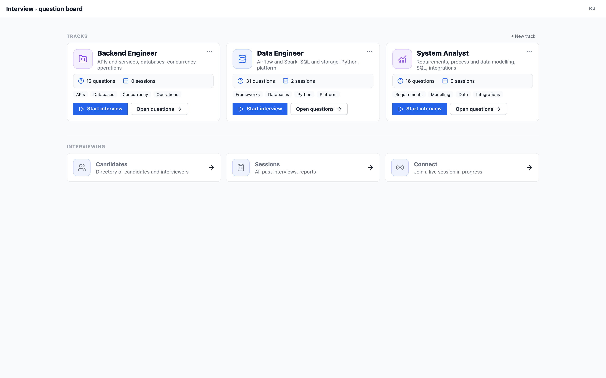

|                                                                                                                                                                                                                                                                                          |                                                                                                                                                                                                                                                                          |
|------------------------------------------------------------------------------------------------------------------------------------------------------------------------------------------------------------------------------------------------------------------------------------------|--------------------------------------------------------------------------------------------------------------------------------------------------------------------------------------------------------------------------------------------------------------------------|
| **Interview setup.** Candidate, sections and sub-columns, levels, and how the set is built: auto-pick N questions by section weights, or take everything that matches in matrix order.<br><br>[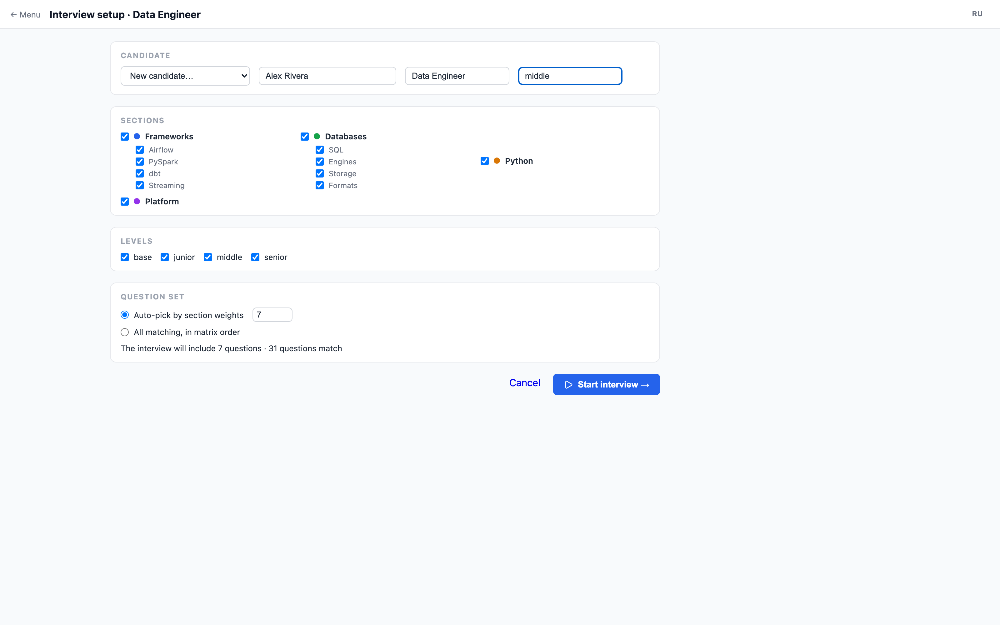](docs/screenshots/02-setup.png)         | **The matrix during a session.** The plan drives the board: questions outside the set are dimmed, the header shows the candidate, live sync and progress against the plan.<br><br>[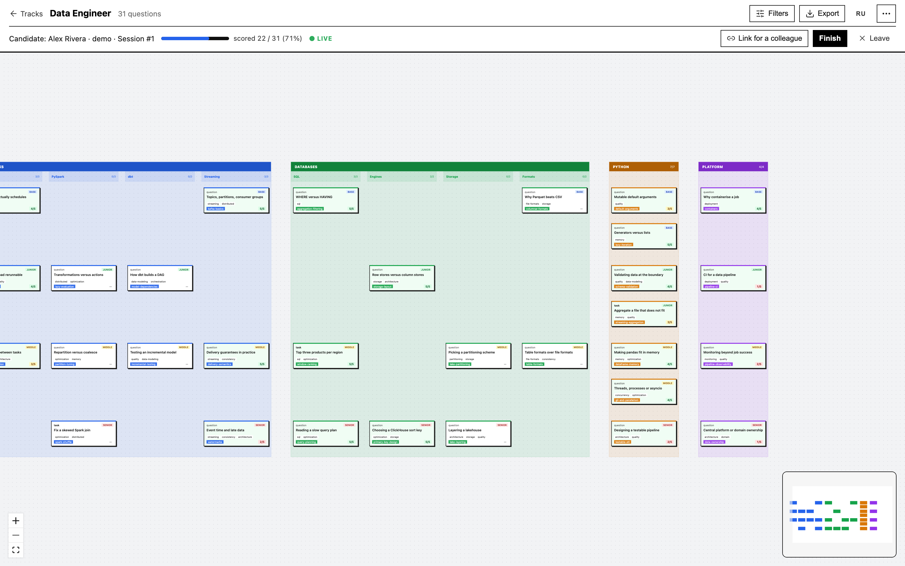](docs/screenshots/03-board.png)     |
| **Scoring from the keyboard.** `1–5` score the current question, `n` jumps to the next unscored one; the HUD at the bottom keeps the current card, its position in the plan and an optional timer.<br><br>[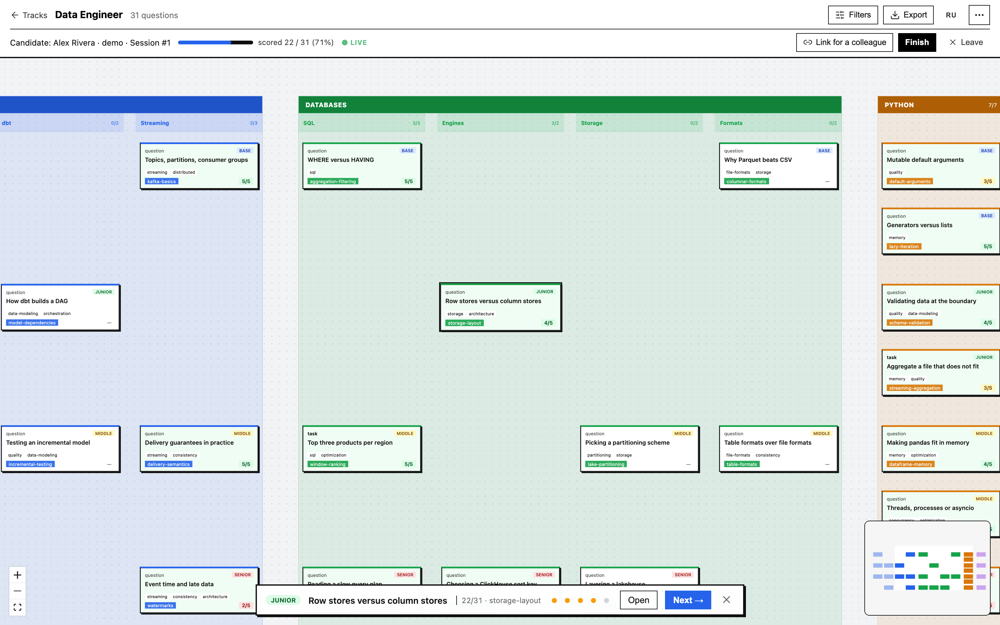](docs/screenshots/04-scoring.png) | **Full text next to the board.** A non-modal drawer: question, reference answer with syntax highlighting, score and the interviewer's note, while the board stays interactive.<br><br>[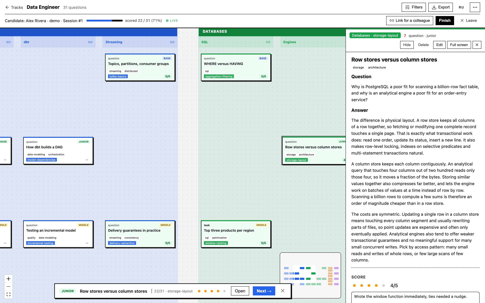](docs/screenshots/05-drawer.png) |
| **Hands-on tasks.** Besides questions the bank holds tasks: a statement, starter code, a reference solution and scoring criteria.<br><br>[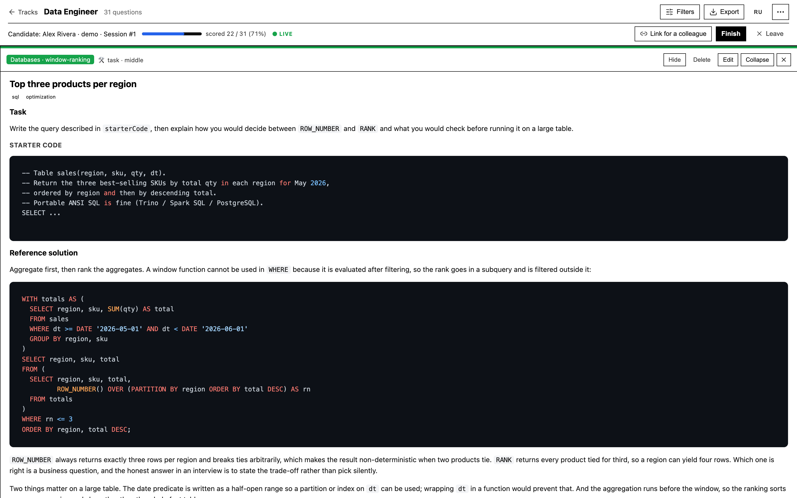](docs/screenshots/06-task.png)                                                                           | **Question bank.** Full-text search and filters over the whole bank; questions are edited and added straight from the UI.<br><br>[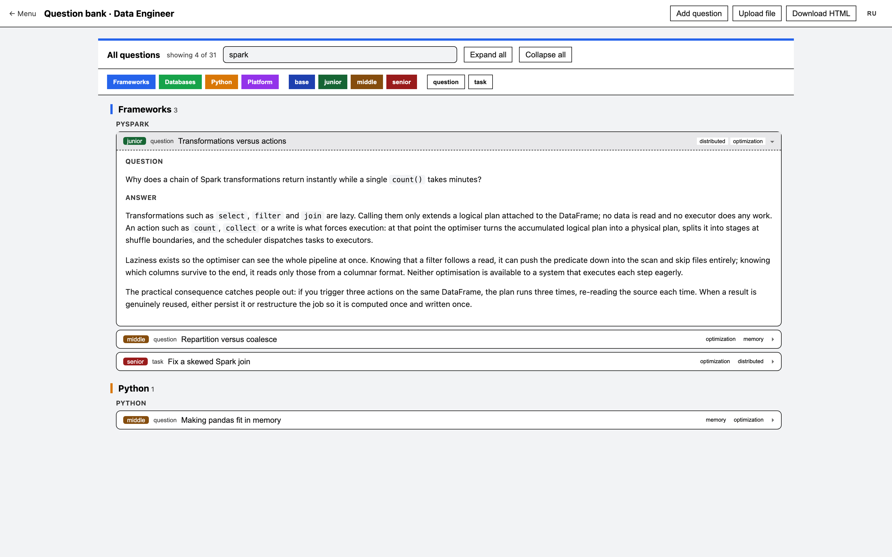](docs/screenshots/07-bank.png)                                                          |
| **Verdict.** Finishing an interview records a decision (hire / no hire / hold) and an overall comment; the session moves to *finished* and the verdict travels into the report.<br><br>[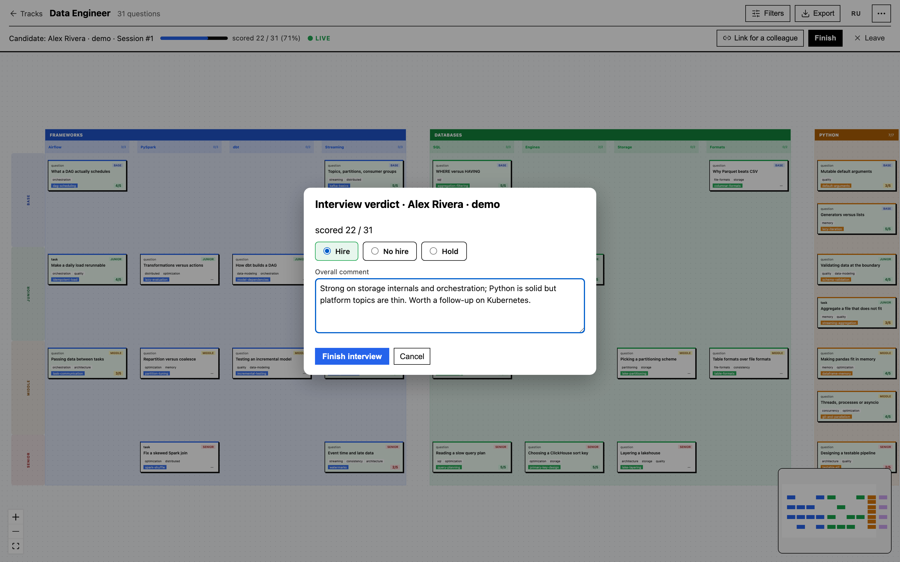](docs/screenshots/08-verdict.png)                    | **Track editor.** Sections and sub-columns are data: rename, reorder by drag and drop, pick a colour from a fixed palette, preview the structure before saving.<br><br>[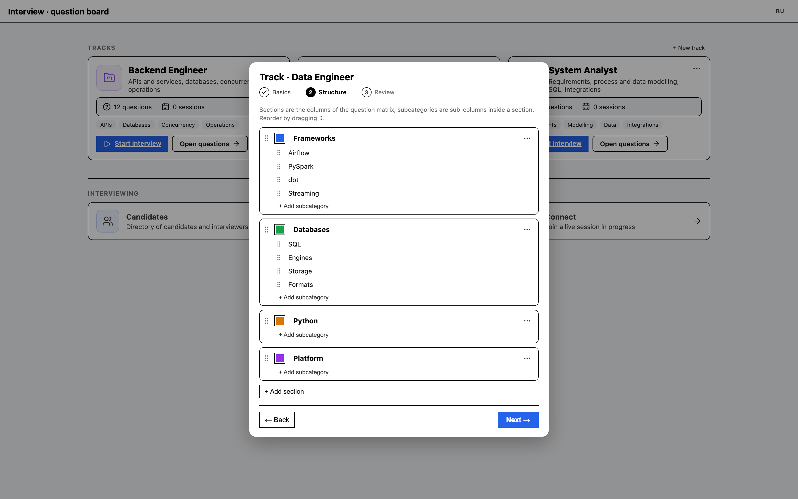](docs/screenshots/10-structure.png)           |

**The report** is generated client-side as one self-contained HTML file: candidate and interviewer,
the verdict with strong and weak sections, average score and coverage per section, and a table of
scored questions with notes. Open it in a browser, print it to PDF, send it as is.

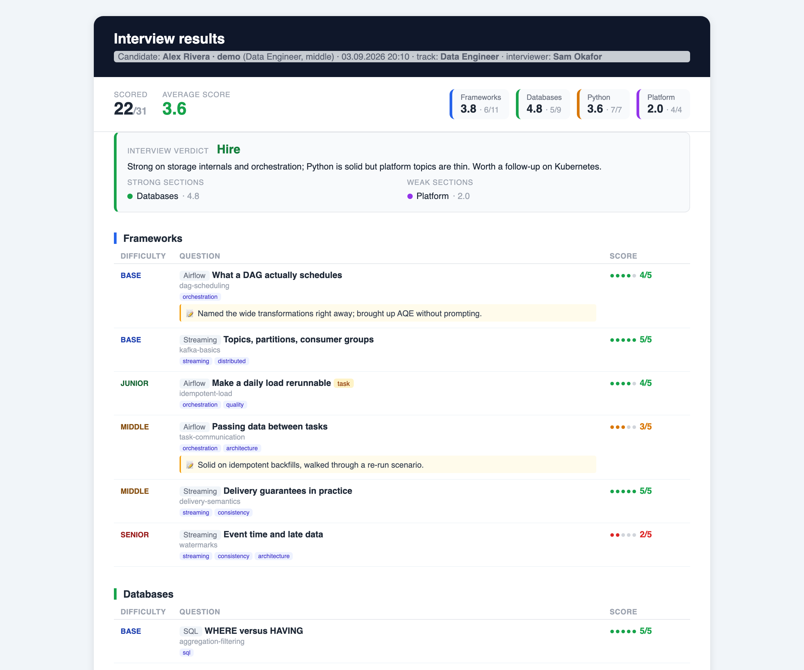

Dark theme is a toggle in the settings panel and is remembered per browser; the system preference
is the default.

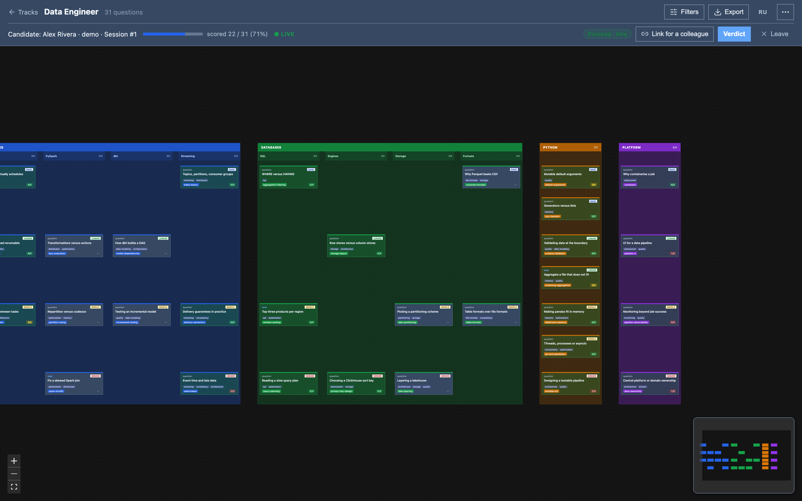

> Screenshots are rebuilt with `npm run shots` from `frontend/` against the English demo content in
> `demo/content-en` — see [Tests](#tests).

## Quick start

```bash
INTERVIEW_OWNER_PASSWORD=<password> ./run.sh   # venv + front-end build (if needed) + server
# open http://localhost:8000 and sign in as owner@interview.local
```

The first launch seeds the owner account `owner@interview.local`. Without
`INTERVIEW_OWNER_PASSWORD` a random password is generated and printed to the server log once — a
known default is deliberately not used. Force a front-end rebuild with `./run.sh --build`.

## Docker

A self-contained image: the front end is built inside, only the database volume is exposed. No
node or python on the host.

```bash
docker compose up -d --build     # http://localhost:8000
docker compose logs -f           # logs
docker compose down              # stop (data stays in the volume)
docker compose down -v           # stop and drop the data
```

Credentials are `admin` / `admin`. Known credentials in `compose.yaml` are intentional: the owner
is seeded once and the volume is persistent, so random ones would mean "no way in after the first
start". Use your own with `INTERVIEW_OWNER_EMAIL=<login> INTERVIEW_OWNER_PASSWORD=<password>
docker compose up -d`; changing them on a running instance requires recreating the volume
(`docker compose down -v`).

If `:8000` is taken (say `./run.sh` already runs there), use
`INTERVIEW_PORT=8080 docker compose up -d`.

The layout inside the container mirrors the server one from `deploy/bootstrap.sh`: code in `/app`,
content in `/app/content`, database in a named volume on `/data`. Rebuilding the image does not
touch the data, and `content/` can stay read-only — the back end never writes there (uploads are
parsed in a temp directory and stored in the database).

## Development mode (hot reload)

Two processes:

```bash
# terminal 1 — back end
cd backend && . .venv/bin/activate && uvicorn app.main:app --reload --port 8000

# terminal 2 — front end (Vite proxies /api to :8000)
cd frontend && npm run dev      # http://localhost:5173
```

## Running an interview

**Set up.** "Start interview" on a track card opens the setup screen: pick or create a candidate,
choose sections and sub-columns, levels, and the mode. *Auto-pick* samples N questions
proportionally to section weights; *all matching* takes every question that fits, in matrix order.
The resulting set is stored with the session as its plan. Starting from the board carries the
current board filters into the setup screen.

**Score.** The board layout is **swimlanes**: a column per section with a coloured translucent
background, questions ranked top to bottom by difficulty (base → junior → middle → senior, the
left axis). A section splits into **sub-columns** through the `subblock` field. A card shows a
short `title` and tags; the full text opens in the drawer. There are no edges between questions —
it is a board of cards grouped by section and difficulty, not a dependency graph.

- **Click a card** — opens the drawer and makes the card current.
- **HUD at the bottom** — current question, position in the plan, 1–5 score, "Next →", timer.
- **Filters** — sections, difficulty, kind and tags, plus full-text search; "unscored only" appears
  inside a session.
- **Keyboard:** `1–5` score the current card, `↑↓` move by difficulty, `←→` between columns,
  `Enter` opens the drawer, `n` goes to the next unscored question, `Esc` clears the current one,
  `?` shows the shortcut cheat sheet.

**Invite a colleague.** A session can be shared by link: pick a role (interviewer who can score, or
observer who only watches) and a lifetime (1 hour, 24 hours, 7 days). The guest joins through
`#/join/<token>` with no account and sees only that session; scores sync live over SSE. Links are
listed with their expiry and can be revoked — a revoked or expired link drops the guest on the next
request.

**Finish.** "Finish" records the decision and an overall comment. The session gets the *finished*
status, and "Export" produces the HTML report described above.

## Content

Questions live in track pools: `content/<pool>/pool.yaml` describes the sections (column order,
labels, colours, sub-columns, weights) and `content/<pool>/<block>/*.md|*.json` holds the questions
themselves. `pool.yaml` is the seed: at runtime tracks are read from the database, so they can be
created, edited and deleted from the UI (`POST/PUT/DELETE /api/pools`). A new track is either a copy
of an existing one (structure and questions included) or a structure you build yourself in the
editor.

The repository ships two Russian-language pools used in real interviews plus a
`demo/content-en` set in English used for the screenshots above.

### Markdown format

```markdown
---
id: spark-shuffle-01
kind: question            # question | task
block: frameworks         # one of blocks[].id in pool.yaml
subblock: pyspark         # (optional) sub-column inside the section
title: Shuffle in Spark   # short heading shown on the card
topic: distributed-batch
difficulty: middle        # base | junior | middle | senior
weight: 13
tags: [optimization, distributed]
---
## Question
The question text…

## Answer
The answer (Markdown, code blocks supported)…
```

- **`title`** — the short heading on the card; the full text lives in the drawer.
- **`tags`** — rendered as chips on the card and available as filters. Keep to the ~17 cross-cutting
  concepts listed in `AGENTS.md`, one to three per card.
- `kind: task` adds `starterCode` and `rubric`, and the body may use `## Task` / `## Solution`.

> **Body parsing:** lines starting with `#` are treated as split markers between question and
> answer. If the answer needs a line starting with `#` outside a code block, set `question` /
> `answer` in the frontmatter directly — then the body is not parsed.

## API

| method | path                        | purpose                                                |
|--------|-----------------------------|--------------------------------------------------------|
| GET    | `/api/pools`                | tracks with sections and counts                        |
| POST   | `/api/pools`                | create a track from a preset or from your own sections |
| GET    | `/api/graph?pool=<id>`      | nodes plus import errors                               |
| POST   | `/api/sessions`             | create a session, optionally with an interview `plan`  |
| POST   | `/api/sessions/{id}/score`  | score a question (`{nodeId, score, note?}`)            |
| POST   | `/api/sessions/{id}/finish` | record the verdict (`{decision, summary}`)             |
| POST   | `/api/sessions/{id}/invite` | link for a colleague (`{role, expires_hours}`)         |
| GET    | `/api/sessions/{id}/events` | live updates over SSE                                  |

That is the core. The full list (candidates and interviewers, node CRUD on `/api/nodes`, import on
`/api/import`, invite management, question sampling on `/api/interview`) and the schemas are in the
Swagger UI at `/docs`.

## Tests

Back end — 122 tests: content import, sampler and interview plans, node CRUD, candidates and
interviewers with tenant isolation, auth and RBAC, track CRUD, session verdicts, guest invites.

```bash
cd backend && . .venv/bin/activate && pytest -q
```

Front end — a headless smoke test of the real runtime: the matrix renders, a card opens the drawer,
a session starts from the setup screen and follows its plan, the verdict lands in the header, a
guest joins by invite link. It needs a running server on `:8000`:

```bash
cd frontend && npm run build     # tsc --noEmit + vite build
npm run i18n:check               # every t("…") key exists in src/i18n/en.ts
npm run smoke
```

Screenshots for this README are the same Playwright setup over a live server: it signs in as the
owner, seeds two demo sessions through the API and captures the screens into `docs/screenshots`.
The demo candidates are synthetic but written to the same database, so run the server on a separate
one — and on the English content:

```bash
INTERVIEW_CONTENT_DIR=$PWD/demo/content-en \
INTERVIEW_DB_PATH=$PWD/backend/demo.db \
INTERVIEW_OWNER_PASSWORD=interview-dev ./run.sh --build

cd frontend && npm run shots     # in a second terminal
```

## Configuration (env)

- `INTERVIEW_CONTENT_DIR` — content directory (default `./content`)
- `INTERVIEW_DB_PATH` — SQLite path (default `backend/interview.db`); use an **absolute** path, the
  server starts from `backend/` and a relative one resolves against it
- `INTERVIEW_FRONTEND_DIR` — built front end (default `frontend/dist`)
- `INTERVIEW_OWNER_PASSWORD` — owner password on first start (random and logged otherwise)

## Deploy

Merging into `main` deploys to the server over SSH via GitHub Actions, port **8800**; `dev` deploys
to port **8801**. Details and the one-time secret setup are in `DEPLOY.md`.

See `REPORT.md` for the design notes behind the architecture, and `AGENTS.md` for the repository
map and content conventions.
